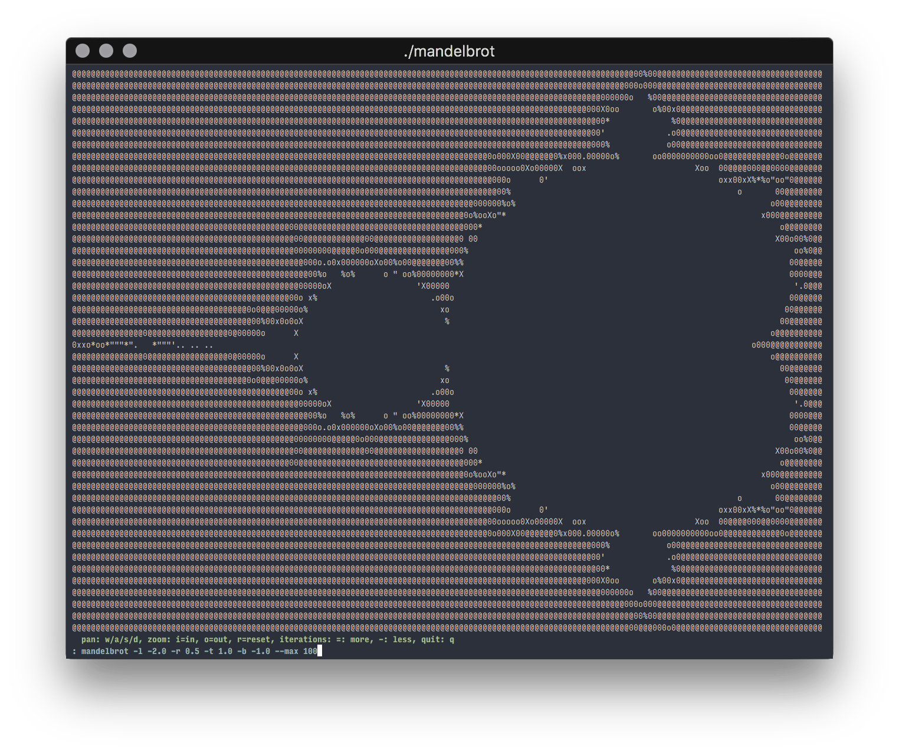

# Mandelbrot Set



```sh
# center
crystal src/ansi.cr

# another place
crystal src/ansi.cr -- -x 0.7288780059956085 -y -0.29203160173167625 -z 2.0e-13 --max 200

# yet another place, with more detail
crystal src/ansi.cr -- -x 0.7346674678648881 -y 0.20688503152309215 -z 2.0e-13 --max 275
```

## Usage

```
Usage: crystal src/ansi.cr -- [arguments]
    -x X                             center point X
    -y Y                             center point Y
    -z ZOOM, --zoom=ZOOM             initial zoom
    --max MAX, --max=MAX             max iterations
    --fps=FPS                        max FPS
    --help                           Show this help
```
